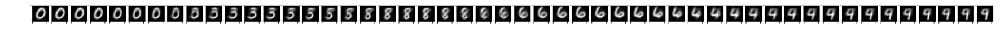
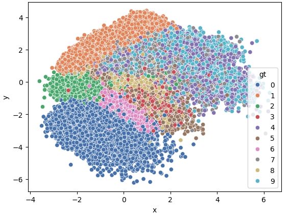
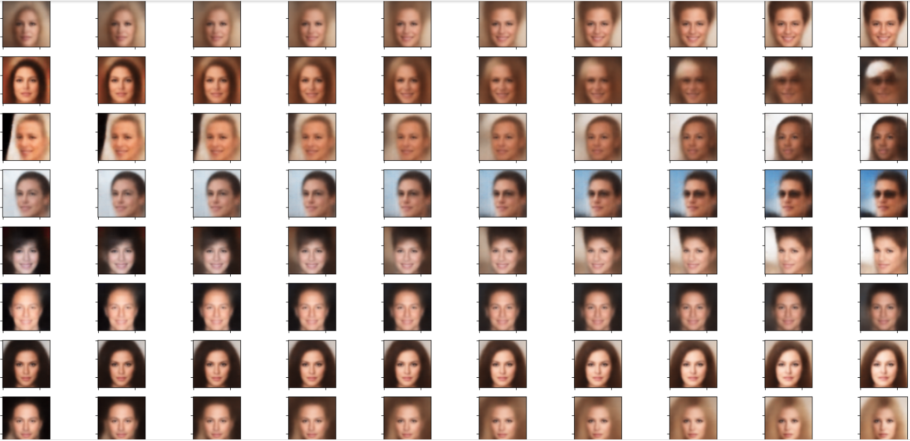

### README.md

#### Autoencoder (AE)
An **Autoencoder (AE)** is a neural network designed for unsupervised learning that compresses input data into a latent space (encoder) and reconstructs it back (decoder). It's useful for dimensionality reduction, feature extraction, and denoising.
For simple implementation on MNIST and code please refer vanilla_ae.py 
## RESULTS

In the above image, the latent space is two-dimensional, enabling the visualization of digit images mapped as distinct clusters. Each cluster corresponds to a specific digit, illustrating how similar data points are grouped together in the latent representation.

In the above image, digit images are reconstructed from their corresponding points in the latent space. Additionally, the intermediate images between two points in the 2D latent space are generated to demonstrate interpolation, highlighting the model's ability to smoothly transition between latent representations.

#### Variational Autoencoder (VAE)
A **Variational Autoencoder (VAE)** extends AEs by introducing probabilistic modeling, enabling generation of new data samples. It learns a latent space with a distribution, ideal for generative tasks and unsupervised learning.
For simple implementation on MNIST and celebA and code please refer vanilla_vae_mnist.py and vanilla_vae_celeba.py respectively. 
## RESULTS

In the above image, similar to Autoencoder, latent space is plotted.

In the above image, faces from the CelebA dataset are reconstructed, and interpolation within the latent space is performed to generate intermediate faces. Since a Variational Autoencoder (VAE) samples from a probabilistic distribution, the interpolated faces are more meaningful and realistic. In contrast, interpolation in a standard Autoencoder (AE) may result in unrealistic or noisy outputs due to its deterministic latent space representation.

