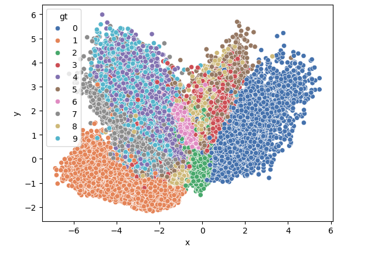

### README.md

#### Autoencoder (AE)
An **Autoencoder (AE)** is a neural network designed for unsupervised learning that compresses input data into a latent space (encoder) and reconstructs it back (decoder). It's useful for dimensionality reduction, feature extraction, and denoising.
For simple implementation on MNIST and code please refer vanilla_ae.py 
## RESULTS

#### Variational Autoencoder (VAE)
A **Variational Autoencoder (VAE)** extends AEs by introducing probabilistic modeling, enabling generation of new data samples. It learns a latent space with a distribution, ideal for generative tasks and unsupervised learning.
For simple implementation on MNIST and celebA and code please refer vanilla_vae_mnist.py and vanilla_vae_celeba.py respectively. 

\

